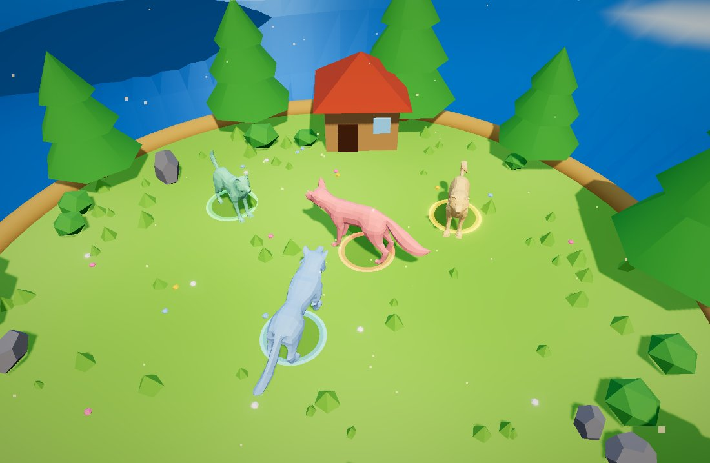

# 파티캣츠 · PARTY CATS

밀치고, 잡고, 던져서 링 밖으로 떨어뜨리는 최대 4인 실시간 3D 물리 파티 배틀.
브라우저(WebGL)에서 설치 없이 즉시 플레이. **Three.js**(렌더) + **Rapier3D**(물리) + 커스텀 게임 루프.

claude.ai 디자인 프로토타입(`game.html` / `game.js`)을 **상용 기반 구조로 재설계**하고,
애니메이션 동물 리그·물리 전투·이동감·로비를 파티 애니멀즈급으로 다듬은 버전입니다.


> 인게임 렌더: 둥근 잔디 아레나 + 팀별 색으로 틴트된 4마리(여우·늑대·허스키·시바). 밀치고 잡고 던져 링 밖으로.

## 게임플레이

6종 동물(여우·늑대·허스키·시바·사슴·알파카) 중 하나를 고르고, 팀 색을 정해 최대 4인이 아레나에서 맞붙습니다.
**색상·캐릭터는 서로 겹치지 않게** 배정되며(온라인은 서버가 강제, 선점된 건 잠금 표시), 라운드제(Best-of-N)로 진행합니다.

### 조작 & 기술
| 입력 | 기술 | 효과 |
|---|---|---|
| 이동 | 걷기/달리기 | 관성 있는 물컹한 가감속(급정거 X), 코너에서 몸이 안쪽으로 뱅킹 |
| 잡기 | 잡기 → 다시 눌러 던지기 | 잡은 채 **빙빙 돌면 차지**돼 더 멀리 던짐(최대 ~2.2×) |
| 박치기 | 머리로 들이받기 | 밀치기(스태거, 안 눕힘) |
| 대시 + 박치기 | **돌진 박치기** | 운동량 실린 램 → 넉다운 |
| 점프 + 대시 | **날라차기** | 최강 피니셔, 크게 날려버림 |
| 점프 + 잡기 | **슬라이딩** | 낮은 태클로 넘어뜨림(트립) |

넉다운 계층: **날라차기 > 슬라이딩 > 돌진 박치기**. 가벼운 박치기·대시는 밀어내기용.
액션은 실제 클립(Attack/Jump/Land/HitReact/Death) + 절차적 포즈로 표현하고, 가만히 있으면 두리번거리는 아이들 fidget이 재생됩니다.

## 실행

```bash
npm install
npm run dev       # 개발 서버 (Vite)
npm run build     # dist/ 로 정적 빌드 → Cloudflare Worker가 서빙 (wrangler.toml)
npm run preview   # 빌드 결과 미리보기
```

## 에셋 배치

캐릭터는 애니메이션이 포함된 Quaternius 동물팩(자체 포함 `.gltf`, 리그·클립 동일)을 사용합니다.
6종이 `public/scene/` 에 있습니다(저장소에 커밋됨):

```
public/scene/Fox.gltf  Wolf.gltf  Husky.gltf  ShibaInu.gltf  Deer.gltf  Alpaca.gltf
public/scene/water_animation.glb   # 바다 (용량 커서 .gitignore — 별도 배치)
```

맵의 통나무집·잔디·꽃은 절차적으로 생성됩니다(별도 소품 GLB 불필요). 경로는 `src/config.js` 의
`ANIMALS` / `ASSETS` 에서 관리합니다. **에셋이 없어도 실행됩니다** — `AssetManager` 가
절차적 대체 모델로 자동 폴백하므로 아트 반영 전에도 로직/물리 검증이 가능합니다.

## 아키텍처

단일 파일 프로토타입을, 시스템별로 분리한 확장 가능한 구조로 재구성했습니다.
서브시스템은 서로를 직접 참조하지 않고 최상위 `Game` 파사드를 통해서만 통신합니다.

```
src/
  config.js            모든 튜닝값·팀·에셋·맵 파라미터 (밸런싱은 여기서)
  main.js              엔트리
  core/
    Game.js            오케스트레이터: 상태 소유 + 서브시스템 배선 + 단일 tick()
    Engine.js          렌더러 / 카메라 / 포스트프로세싱 / 조명 / 안개(렌더 거리)
    GameLoop.js        rAF 드라이버 (dt 클램프)
    AssetManager.js    glTF 로딩 + 진행률 + 절차적 폴백
  physics/Physics.js   Rapier 월드 래퍼 (고정 스텝, 아레나 콜라이더, 접지 레이)
  world/Arena.js       스카이돔 / 플랫폼 / 지면 스커트 / 소품 / 파티클  (맵 교체 지점)
  entities/
    Cat.js             팀 틴트 머티리얼 + 애니메이션 컨트롤러 (발 미끄러짐 해결)
    Player.js          바디 + 상태 + 이동 컨트롤러(속도 타깃) + 포즈
  gameplay/
    Actions.js         점프·대시·잡기·던지기·슬램 (능력 = 목표 속도, config 기반)
    Bot.js             AI (메뉴 앰비언트 / 전투)
    Match.js           라운드·점수·스폰·탈락·결과 (Best-of-N)
  camera/CameraRig.js  오빗 + 플레이어 추적 + 셰이크
  fx/Effects.js        먼지·링·스트릭·셰이크·플래시·컨페티 (풀링)
  ui/
    UI.js              화면 전환·로비·HUD·배너·카운트다운·결과
    Portraits.js       실제 모델 render-to-texture 로비 초상화
  input/Input.js       키보드 + 가상 조이스틱 + 액션 패드 → 단일 의도
  loader/LoaderFx.js   로딩 화면 파티클
```

### 새 콘텐츠 추가 지점
- **캐릭터**: `config.ANIMALS` 에 `{id,name,asset}` 추가 + 필요 시 `config.BONEMAP` 에 뼈 매핑 / **팀 색**: `config.TEAMS`
- **맵**: `world/` 에 `{ addTo(scene), update(dt) }` 형태의 새 아레나 클래스
- **능력**: `gameplay/Actions.js` 에 메서드 추가 후 `Input`/`Bot` 에서 바인딩
- **밸런스**: 전부 `config.js`

## 프로토타입 대비 개선점

**이동/속도의 자연스러움**
- 프로토타입: 매 프레임 raw force + 1.8 m/s 소프트 캡 → 굼뜨고 붕 뜬 조작감.
- 변경: **목표 속도 기반 컨트롤러** — 유한 가속도로 목표 속도(기본 6.2 m/s)까지 크리스프하게 스티어링.
  피격 직후 `knockWindow` 동안 스티어링을 멈춰 넉백이 죽지 않고 물리적으로 살아남음.
- **애니메이션 발 미끄러짐 해결**: Walking 클립 재생 속도를 실제 지면 속도에 동기화
  (`timeScale = speed / refSpeed`), 속도에 따라 idle↔walk 크로스페이드. (프로토타입의 고정 timeScale 제거)
- 점프/대시/던지기/슬램을 임펄스가 아닌 **목표 속도**로 표현해 튜닝이 직관적.

**렌더링 거리**
- **HiDPI 캔버스 버그 수정**: 프로토타입은 `setSize(w,h,false)` 로 캔버스 CSS 크기를 지정하지 않아
  DPR=2 화면에서 캔버스가 뷰포트의 2배로 렌더 → 씬이 화면 구석에 치우쳐 보이던 문제를 해결.
- Exp2 안개 → **스카이 지평선 색과 맞춘 선형 안개**(아레나 근처는 선명, 원경만 자연스럽게 흐려짐).
- 플랫폼이 허공에 뜬 느낌이 나지 않도록 **넓은 지면 스커트**를 추가해 원경이 안개로 사라지게 처리.
- 그림자 프러스텀을 아레나+소품 전체로 확장.

## 배포
`production` 브랜치 푸시 시 GitHub Actions(`.github/workflows/deploy.yml`)가
`npm ci → build → wrangler deploy` 로 Cloudflare Workers에 정적 서빙합니다.
